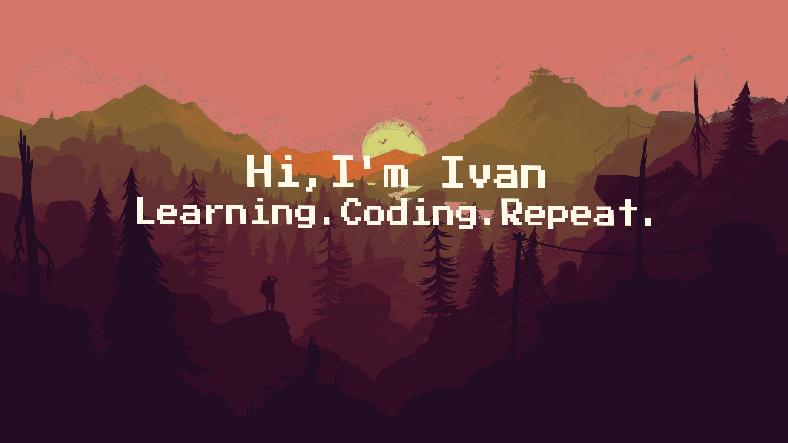

  

<h2></h2>

💻 Computer Science student at Lviv National Polytechnic University 🏛️, passionate about creating full-stack applications with modern JavaScript libraries and frameworks. 🚀 Always eager to learn new technologies, explore innovative solutions, and grow as a developer through continuous improvement and hands-on projects. 🌱 Currently diving deeper into Data Structures and Algorithms 📚 to strengthen problem-solving skills.

<h2 align="center">📦Tech Stack</h2>

     
    

